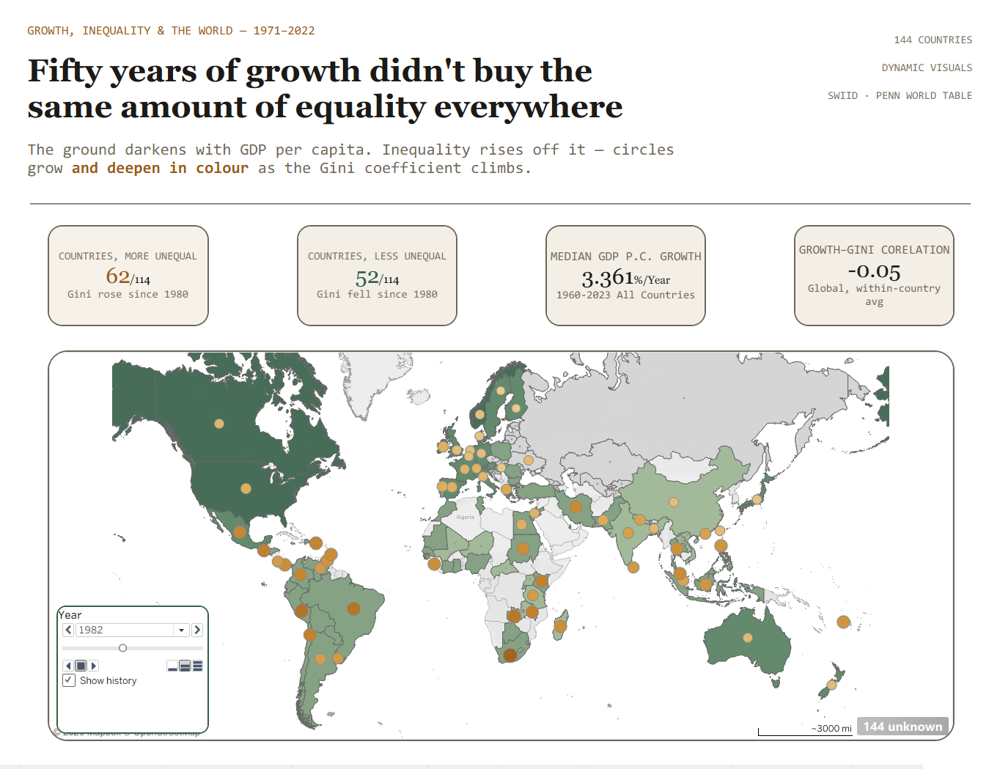
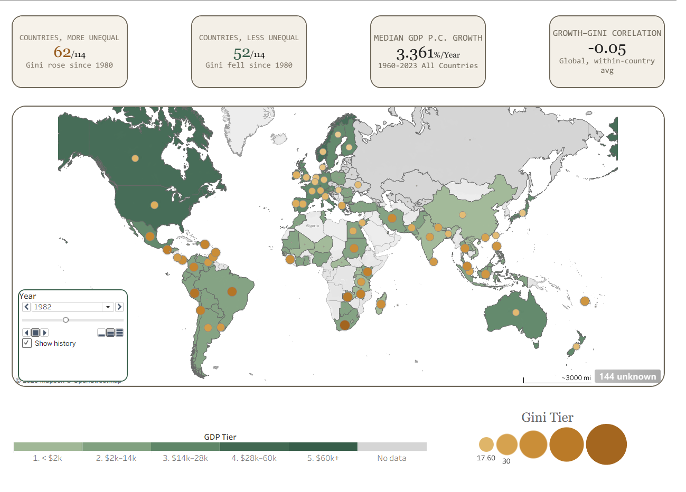
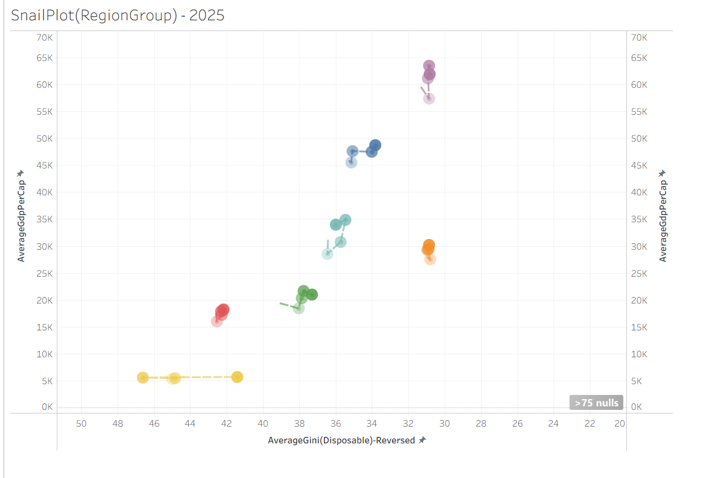
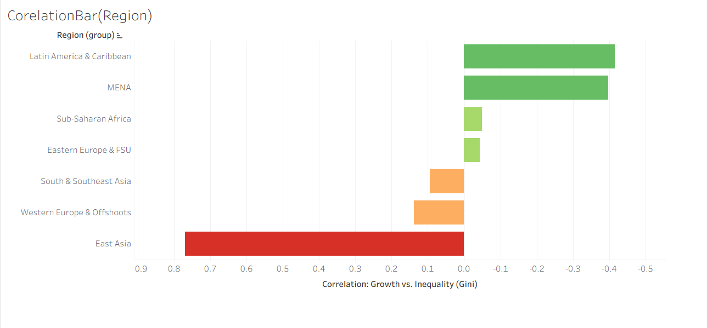

# Growth, Inequality & the World (1971–2022)
### Did fifty years of economic growth reduce poverty — or just concentrate wealth?

A 52-year, 114-country panel study testing whether GDP growth is associated with falling inequality, and where in the world that relationship breaks down.

**Data pipeline:** Python · PostgreSQL &nbsp;|&nbsp; **Visualization:** Tableau · Plotly &nbsp;|&nbsp; **Status:** Data pipeline complete → Dashboards in progress

---

## Overview

Rising GDP is often treated as shorthand for "things are getting better," but growth and inequality don't always move together. This project builds a clean, analysis-ready panel dataset spanning **114 countries and 52 years (1971–2022)** by integrating four independent global data sources, then uses it to test four hypotheses about how growth, redistribution, and income distribution relate to one another — and how much that relationship varies by region.

The full pipeline — extraction, cleaning, standardization, validation, and loading — is built and documented. The project is now in the Tableau dashboard phase.

## Hypotheses

| | Question |
|---|---|
| **H1** | Does GDP per capita growth correlate with rising or falling Gini coefficients — and does that relationship vary by region? |
| **H2** | Do countries with stronger redistribution (tax-and-transfer policy) show smaller increases in inequality despite growth? |
| **H3** | Has the income share gap between the top 20% and bottom 50% widened or narrowed over the 52-year window? |
| **H4** | Does GDP growth translate into meaningful poverty-headcount reduction, or does growth bypass the poorest? |

## Data Sources

| Source | Coverage | Key Variables |
|---|---|---|
| [SWIID v9.92](https://fsolt.org/swiid/) | 199 countries, 1960–present | Gini (disposable & market income), redistribution (`abs_red`, `rel_red`) |
| [Penn World Table 11.0](https://www.rug.nl/ggdc/productivity/pwt/) | 185 countries, 1950–2023 | GDP per capita (derived: `rgdpe / pop`), population |
| [World Bank PIP](https://pip.worldbank.org/) | 172 countries, 1963–2025 | Poverty headcount, poverty gap, income deciles |
| [WID.world](https://wid.world/) | Up to 263 countries, 1950–2024 | Top 20% / bottom 50% pre-tax income shares |

Full column-level documentation, known data-quality issues, and every cleaning decision are logged in [`DATA_NOTES.md`](./DATA_NOTES.md).

## Pipeline Architecture

```
Extract  →  Clean (per source)  →  Standardize on ISO3  →  Merge  →  Load to PostgreSQL  →  Validate (SQL)  →  Export
```

1. **Extract** four raw sources with incompatible formats, units, and country identifiers.
2. **Clean** each source independently (e.g., deriving `gdppc = rgdpe / pop` for PWT, resolving SWIID's posterior-draw structure, parsing WID's multi-line variable field).
3. **Standardize** every source onto ISO3 country codes to eliminate join and geocoding failures.
4. **Merge** all four sources into a single denormalized `country_year_panel` table.
5. **Load** into PostgreSQL and **validate** with a SQL check suite before anything reaches a dashboard.
6. **Export** the validated panel for visualization in Tableau and Plotly.

Along the way, a redistribution metric with **58% structural missingness** (SWIID only reports it where paired market/disposable survey evidence exists) was recovered via hybrid imputation — retaining real survey values and deriving the rest, with every derived value flagged rather than silently treated as observed.

## Tech Stack

- **Python** — pandas, SQLAlchemy, psycopg2-binary, pyarrow, country_converter, wbgapi
- **PostgreSQL** — storage, joins, and pre-visualization validation
- **Tableau** — interactive dashboards (LOD expressions, cascading filter actions, drill-down)
- **Plotly** — animated visualizations *(in progress)*

## Repository Structure

```
Growth-Inequality-Measures-A-Panel-Data-Study/
├── Data/           # Raw and processed datasets
├── Notebook/       # Exploratory analysis & validation notebooks
├── Scripts/        # Source-specific ETL scripts
├── screenshots/    # Tableau dashboard screenshots (referenced below)
├── DATA_NOTES.md   # Living technical log of sources, issues, and decisions
├── .gitignore
└── README.md
```

## Early Findings

- **62 of 114 countries** grew more unequal (Gini rose) since 1980; **52 of 114** grew less unequal.
- Median GDP per capita growth across all countries, 1960–2023: **3.36%/year**.
- The **global** growth–inequality correlation is close to flat (**−0.05**) — but that average hides sharp regional splits:
  - **Latin America & Caribbean** and **MENA** show the strongest *positive* growth–inequality correlation (growth accompanying rising Gini).
  - **East Asia** shows a strong *negative* correlation (growth accompanying falling Gini) — the sharpest counter-example to the regional norm.
  - **South & Southeast Asia** and **Western Europe & Offshoots** sit close to zero, mildly negative.

These are early, exploratory signals from the dashboards below — full hypothesis-by-hypothesis findings will be written up as H2–H4 are completed.

## Tableau Dashboard Preview

### Point 0 — Hook / Landing Page
Dual-encoded world map: sequential green fill for GDP per capita tier, bronze bubble overlay (size + color) for the Gini coefficient, with a year slider spanning 1971–2022.



Detail view showing the GDP-tier legend and Gini bubble scale used to encode the map:



### H1 — Growth vs. Inequality *(in progress)*
Region-group "snail plot" tracing each region's trajectory through GDP-per-capita × Gini(disposable) space over time — each trail shows a region moving (or not) toward lower inequality as it grows richer.



Ranked correlation bar chart — the growth–inequality relationship's strength and direction by region, part of the three-level (category → region → country) drill-down.



## Project Status

- [x] Data pipeline — extract, clean, standardize, merge, validate
- [x] PostgreSQL schema and validation suite
- [x] Hook / landing dashboard
- [ ] H1 dashboard (growth vs. inequality) — in progress
- [ ] H2 dashboard (redistribution)
- [ ] H3 dashboard (income share gap)
- [ ] H4 dashboard (growth vs. poverty)
- [ ] Plotly animated visualizations
- [ ] Written findings report

## Methodology Notes

Detailed, source-by-source documentation of column definitions, missingness, outlier handling, and every non-obvious decision (e.g., why PWT was chosen over World Bank as the primary GDP source, how the `gini_mkt < gini_disp` anomaly was investigated and resolved) lives in [`DATA_NOTES.md`](./DATA_NOTES.md).

## Author

**Nishit** — [github.com/Nishit2001](https://github.com/Nishit2001)
